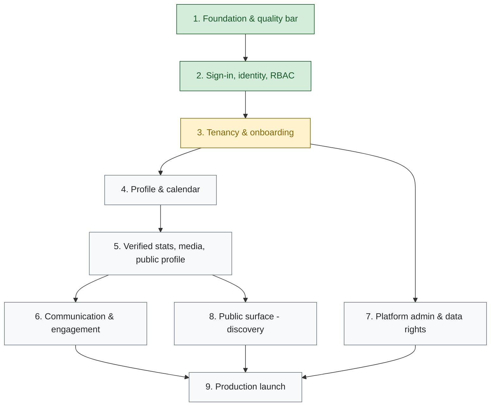

# Athlete Portal — Roadmap

> Human-readable map of where the product is going. Links GitHub Epics, milestones, Gherkin feature files, Test Plans, and Exploratory Charters so a reader can jump from "what are we building" to "how do we know it works."
>
> **Authoritative ordering and exit gates live here.** GitHub Issues hold the live state of each Epic; when the Epic body and this file disagree on scope, the Epic wins — open a PR to fix this file. The MVP capabilities below are ordered by **dependency, not date**: an Epic never appears in an earlier capability than something it depends on. Each Epic also declares its prerequisites in a `## Depends on` block on its GitHub issue; that block is the source of truth for individual dependencies, and any time it changes, audit this file in the same PR.
>
> **Completion indicators:** ✅ shipped (Epic closed) · ⬜ open (planned or in flight; child-Story progress lives on the Epic issue).
>
> Companion: [`testing-strategy.md`](testing-strategy.md) defines the automated test pyramid, quality baselines, and the **Manual QA gate** referenced in each capability's exit gates below (see [§ Manual Testing](testing-strategy.md#manual-testing) and [§ Phase gates](testing-strategy.md#phase-gates)).

## See also

- [`architecture.md`](architecture.md) — tech stack, workspace boundaries, cross-cutting flows.
- [`personas.md`](personas.md) — the canonical persona taxonomy and the trust-chain graph.
- [`data-dictionary.md`](data-dictionary.md) — entity definitions and the `(role, resource, action)` RBAC matrix.
- [`testing-strategy.md`](testing-strategy.md) — automated pyramid, quality baselines, manual-QA cadence, QA corpus.
- [`decisions.md`](decisions.md) — architecture decision records (ADRs) and the index of `decisions/`.
- [`patterns.md`](patterns.md) — recurring code patterns and the Biome/ESLint boundary.
- [`web-routes.md`](web-routes.md) — registered web routes and their access posture.
- [`style-guide.md`](style-guide.md) — UI language, copy tone, accessibility posture.

---

## Product overview

**Athlete Portal** is a multi-tenant platform for youth, club, and collegiate sports. It gives an athlete a **canonical, portable, verifiable record** of their athletic career — a profile they own, with stats and achievements that a college coach or recruiter can trust because the trust chain runs through their actual coach, not through self-report.

### The wedge

Most "athlete profile" sites are unverified social feeds. Athlete Portal makes verification structural: an **organization** vouches for a **team**, a **coach** runs the team and **signs** an athlete's stats, and only signed stats display as verified. Self-reported data is either marked clearly or excluded entirely. That's the differentiator: a portable record that's defensible because it can't be inflated by the athlete who owns it.

### Target customers

- **Athletes** (13–22, club / school / collegiate) — the canonical user. They maintain the profile and share its public URL.
- **Coaches** — the trust-chain linchpin. They manage their team and verify achievements.
- **Org admins** (clubs, schools, athletic departments) — the patient-zero customer. They bring the team-and-coach graph the rest of the product depends on.
- **Visitors** (college coaches, scouts, family) — consume public profiles to evaluate athletes.
- **Platform admins** — operator staff onboarding seed orgs, handling support, and running platform operations.

Full persona taxonomy in [`personas.md`](personas.md).

### Key differentiators

- **Trust chain by construction.** Verification is a separation-of-duty: only coaches can sign stats; org admins cannot self-attest into the chain.
- **Multi-tenant from day one.** Every read and write is scoped to the tenant graph; cross-tenant access is impossible by policy, exercised by contract and property tests.
- **Public profile as a portable artifact.** A `/u/<vanity>` URL that renders verified badges, SEO-ready, shareable to recruiters.
- **Minor-athlete safety as a first-class feature.** MAAPP, SafeSport, COPPA/VPC posture, and PII guardrails govern every comms and content surface.

### Non-goals

Listed explicitly so scope creep gets caught early. AthPortal is **not**:

- **A public social feed.** Engagement surfaces are tenant-scoped (team feed, RSVP, reactions). The post-MVP social expansion in [v1.0 Capability 8](#8-social-expansion-with-safety) is gated by MAAPP / SafeSport, not designed as a TikTok-style discovery feed.
- **A recruiting agency.** The platform makes an athlete's record portable and verifiable; it does not place athletes with programs, broker introductions, or negotiate on behalf of athletes or families.
- **A parental-monitoring tool.** The Family Center exists to satisfy parental-consent posture and minor-athlete safety, not to surveil athlete activity. Read-access controls follow the persona taxonomy in [`personas.md`](personas.md).
- **A general-purpose team-management app.** Roster, schedule, and comms exist *in service of* the verified-record wedge — not as the product. If a capability would only matter for a team that didn't care about a verifiable record, it's the wrong product.
- **A free-for-all media platform.** Every upload runs the pre-publish safety pipeline ([#17](https://github.com/dsj1984/athportal/issues/17)) before it's visible.

---

## Version: MVP

Launchable platform for **invite-only seed orgs**. Establishes the trust chain end-to-end (org → team → coach → verified athlete stat), opens private-tenant surfaces (profile, calendar, stats, media, comms), then opens public surfaces (public profile, discovery directories) under the safety and compliance posture required for minor athletes. The milestone is "an org admin can onboard a club, a coach can verify a stat, an athlete's public profile reflects it, and a visitor can find it."

Milestone: [MVP](https://github.com/dsj1984/athportal/milestone/1).

### Capability dependency graph

### Capabilities, in delivery order

#### 1. Foundation & quality bar *(shipped)*

Toolchain, CI, observability, baselines, the three-tier test infrastructure, the design system, and the agent-driveable QA corpus. Not user-visible, but every later capability is built on it.

##### Epics

- ✅ [#2](https://github.com/dsj1984/athportal/issues/2) — Monorepo, workspace tooling, and code quality baseline
- ✅ [#3](https://github.com/dsj1984/athportal/issues/3) — CI pipelines, two-environment deploy promotion, and secret management
- ✅ [#4](https://github.com/dsj1984/athportal/issues/4) — Three-tier testing infrastructure (unit, contract, acceptance)
- ✅ [#5](https://github.com/dsj1984/athportal/issues/5) — Observability vendor stack — Sentry, log sink, uptime probes, alert path
- ✅ [#6](https://github.com/dsj1984/athportal/issues/6) — Seven quality baselines, ratchet gates, and supply-chain CVE gate
- ✅ [#386](https://github.com/dsj1984/athportal/issues/386) — Finalize Foundation — CI cost cuts, supply chain, structural cleanup
- ✅ [#702](https://github.com/dsj1984/athportal/issues/702) — Design system — tokens, primitives, live in-app reference
- ✅ [#741](https://github.com/dsj1984/athportal/issues/741) — Foundation hardening — make apps/web actually run, end-to-end
- ✅ [#775](https://github.com/dsj1984/athportal/issues/775) — Manual + agent-driveable QA corpus (Test Plans + Exploratory Charters)
- ✅ [#828](https://github.com/dsj1984/athportal/issues/828) — Web UI styling completion — eliminate orphan BEM, lock in the convention
- ✅ [#869](https://github.com/dsj1984/athportal/issues/869) — Drive the QA-corpus agent runner to green against every generated Test Plan and Charter

##### Feature files

- [`design-system/badge.feature`](../tests/features/design-system/badge.feature)
- [`design-system/btn.feature`](../tests/features/design-system/btn.feature)
- [`design-system/display-atoms.feature`](../tests/features/design-system/display-atoms.feature)
- [`design-system/event-chip.feature`](../tests/features/design-system/event-chip.feature)
- [`design-system/form-primitives.feature`](../tests/features/design-system/form-primitives.feature)
- [`design-system/foundations.feature`](../tests/features/design-system/foundations.feature)
- [`design-system/patterns-doc.feature`](../tests/features/design-system/patterns-doc.feature)
- [`design-system/shell.feature`](../tests/features/design-system/shell.feature)
- [`design-system/style-guide-doc.feature`](../tests/features/design-system/style-guide-doc.feature)
- [`design-system/styleguide-page.feature`](../tests/features/design-system/styleguide-page.feature)
- [`design-system/toast.feature`](../tests/features/design-system/toast.feature)
- [`foundation/web-acceptance-smoke.feature`](../tests/features/foundation/web-acceptance-smoke.feature)
- [`observability/ci-fork-safety.feature`](../tests/features/observability/ci-fork-safety.feature)
- [`observability/finops-cost-ceiling.feature`](../tests/features/observability/finops-cost-ceiling.feature)
- [`observability/redaction-allowlist-discoverability.feature`](../tests/features/observability/redaction-allowlist-discoverability.feature)
- [`observability/request-completion-logging.feature`](../tests/features/observability/request-completion-logging.feature)
- [`observability/sentry-alert-path.feature`](../tests/features/observability/sentry-alert-path.feature)
- [`observability/synthetic-failure-rehearsal.feature`](../tests/features/observability/synthetic-failure-rehearsal.feature)
- [`observability/uptime-probe-alerts.feature`](../tests/features/observability/uptime-probe-alerts.feature)

##### Shared exploratory heuristics (reused across charters in every capability)

- [`auth-fuzz.md`](../tests/charters/_heuristics/auth-fuzz.md)
- [`boundary-values.md`](../tests/charters/_heuristics/boundary-values.md)
- [`cross-tenant-probe.md`](../tests/charters/_heuristics/cross-tenant-probe.md)
- [`email-collision.md`](../tests/charters/_heuristics/email-collision.md)
- [`encoding-fuzz.md`](../tests/charters/_heuristics/encoding-fuzz.md)
- [`form-fuzz.md`](../tests/charters/_heuristics/form-fuzz.md)
- [`landmark-tour.md`](../tests/charters/_heuristics/landmark-tour.md)
- [`money-tour.md`](../tests/charters/_heuristics/money-tour.md)

**Exit gate:** all foundation Epics closed, `main` green, baselines primed.

#### 2. Sign-in, identity, and RBAC *(shipped)*

Authentication, session management, and the `(role, resource, action)` policy module every protected route runs through. Clerk-backed; test-auth seam for CI personas.

##### Epics

- ✅ [#7](https://github.com/dsj1984/athportal/issues/7) — Authentication, session, and RBAC policy

##### Feature files

- [`identity/auth/anonymous-redirect.feature`](../tests/features/identity/auth/anonymous-redirect.feature)
- [`identity/auth/protected-route-smoke.feature`](../tests/features/identity/auth/protected-route-smoke.feature)
- [`identity/auth/rejected-sign-in.feature`](../tests/features/identity/auth/rejected-sign-in.feature)
- [`identity/auth/session-restore.feature`](../tests/features/identity/auth/session-restore.feature)
- [`identity/auth/sign-in.feature`](../tests/features/identity/auth/sign-in.feature)
- [`identity/auth/sign-out.feature`](../tests/features/identity/auth/sign-out.feature)
- [`identity/rbac/last-admin.feature`](../tests/features/identity/rbac/last-admin.feature)
- [`identity/rbac/matrix-publication.feature`](../tests/features/identity/rbac/matrix-publication.feature)

##### Charters

- [`ec-identity-auth-fuzz`](../tests/charters/identity/ec-identity-auth-fuzz.charter.md)

#### 3. Tenancy and onboarding *(in progress)*

The multi-tenant data model and the server-enforced gate every authenticated user clears before any feature surface unlocks. Nothing else is safe to build until tenant isolation and onboarding hold server-side.

##### Epics

- ✅ [#8](https://github.com/dsj1984/athportal/issues/8) — Server-enforced onboarding gate and ToS acceptance
- ✅ [#9](https://github.com/dsj1984/athportal/issues/9) — Org / team / coach / athlete data model and multi-tenant isolation
- ✅ [#10](https://github.com/dsj1984/athportal/issues/10) — Org configuration, team creation, invitations, and bulk import
- ✅ [#11](https://github.com/dsj1984/athportal/issues/11) — Digital roster, athlete invitations, and team-scoped access
- ⬜ [#23](https://github.com/dsj1984/athportal/issues/23) — Versioned legal documents — ToS, Privacy Policy, cookie consent

##### Dependencies

- #8, #9 → #7 (auth)
- #23 → #8 (onboarding owns the ToS acceptance moment)
- #10, #11 → #9 (need the org/team graph)

##### Cross-cutting work

- Publish the `(role, resource, action)` matrix in [`data-dictionary.md`](data-dictionary.md). The policy module already exists in [`packages/shared/src/rbac/`](../packages/shared/src/rbac/) (landed with #7); the open work is keeping the published table current as #9–#11 expand the surface.
- First exercise of the cross-tenant isolation property tests against a real Clerk test instance.

##### Feature files

- [`identity/onboarding/age-gate.feature`](../tests/features/identity/onboarding/age-gate.feature)
- [`identity/onboarding/complete-onboarding.feature`](../tests/features/identity/onboarding/complete-onboarding.feature)
- [`identity/onboarding/dashboard-empty-states.feature`](../tests/features/identity/onboarding/dashboard-empty-states.feature)
- [`identity/onboarding/email-verification-gate.feature`](../tests/features/identity/onboarding/email-verification-gate.feature)
- [`identity/onboarding/gate-redirect.feature`](../tests/features/identity/onboarding/gate-redirect.feature)
- [`identity/onboarding/idempotency.feature`](../tests/features/identity/onboarding/idempotency.feature)
- [`identity/onboarding/legal-acceptance.feature`](../tests/features/identity/onboarding/legal-acceptance.feature)
- [`identity/onboarding/optional-photo.feature`](../tests/features/identity/onboarding/optional-photo.feature)
- [`identity/onboarding/parent-athlete-link.feature`](../tests/features/identity/onboarding/parent-athlete-link.feature)
- [`identity/isolation/cross-tenant-property.feature`](../tests/features/identity/isolation/cross-tenant-property.feature)
- [`identity/isolation/cross-tenant-read.feature`](../tests/features/identity/isolation/cross-tenant-read.feature)
- [`identity/team/admin-team-crud.feature`](../tests/features/identity/team/admin-team-crud.feature)
- [`identity/team/soft-delete-recovery.feature`](../tests/features/identity/team/soft-delete-recovery.feature)
- [`identity/athlete/cross-org-membership.feature`](../tests/features/identity/athlete/cross-org-membership.feature)
- [`identity/athlete/hard-delete-tombstone.feature`](../tests/features/identity/athlete/hard-delete-tombstone.feature)
- [`org-admin/org-config.feature`](../tests/features/org-admin/org-config.feature)
- [`org-admin/org-roster.feature`](../tests/features/org-admin/org-roster.feature)
- [`org-admin/coach-invitation.feature`](../tests/features/org-admin/coach-invitation.feature)
- [`org-admin/athlete-direct-invitation.feature`](../tests/features/org-admin/athlete-direct-invitation.feature)
- [`org-admin/invitation-management.feature`](../tests/features/org-admin/invitation-management.feature)
- [`org-admin/csv-import.feature`](../tests/features/org-admin/csv-import.feature)
- [`org-admin/season-rollover.feature`](../tests/features/org-admin/season-rollover.feature)
- [`org-admin/verified-achievement-report.feature`](../tests/features/org-admin/verified-achievement-report.feature)
- [`coach/roster/digital-roster.feature`](../tests/features/coach/roster/digital-roster.feature)
- [`coach/roster/roster-invites.feature`](../tests/features/coach/roster/roster-invites.feature)
- [`coach/roster/team-scoped-access.feature`](../tests/features/coach/roster/team-scoped-access.feature)

##### Charters

- [`ec-identity-cross-tenant`](../tests/charters/identity/ec-identity-cross-tenant.charter.md)
- [`ec-org-admin-csv-import`](../tests/charters/org-admin/ec-org-admin-csv-import.charter.md)
- [`ec-org-admin-invitation-flow`](../tests/charters/org-admin/ec-org-admin-invitation-flow.charter.md)
- [`ec-org-admin-season-rollover`](../tests/charters/org-admin/ec-org-admin-season-rollover.charter.md)

##### Exit gates

- A coach can sign up, accept ToS, create an org, create a team, invite an athlete, and have that athlete appear on the roster.
- Manual QA gate: tenancy-isolation charter (see [`testing-strategy.md` § Phase gates](testing-strategy.md#phase-gates)).
- Known deferral: acceptance-tier coverage for the onboarding gate is parked at `@pending` until the Clerk persona-CI seam lands in [#383](https://github.com/dsj1984/athportal/issues/383). Server-side correctness is pinned by contract tests in the meantime.

#### 4. The athlete's profile and the team calendar

The canonical athlete profile is the wedge artifact. The calendar is the recurring touchpoint that brings users back. These are the two private surfaces every later feature decorates. The **public** projection of the profile is deferred to the next capability because it depends on the verified-stat badges that land there.

##### Epics

- ⬜ [#12](https://github.com/dsj1984/athportal/issues/12) — Canonical athlete profile (attributes, academic, vanity URL, privacy, completion)
- ⬜ [#13](https://github.com/dsj1984/athportal/issues/13) — Core calendar UI, expanded event types, RSVP, and outbound iCal feed

##### Dependencies

- #12 → #9 (athlete entity comes from the org/team graph)
- #13 → #11 (events scope to teams / rosters)

##### Cross-cutting work

- Vanity-URL collision policy decision recorded in [`decisions/`](decisions/).

**Feature files / test plans:** authored as Epics ship.

##### Exit gates

- An athlete can complete their canonical profile to 100%, and a coach can publish an event the athlete RSVPs to.
- Manual QA gate: profile-completion + calendar charters.

#### 5. Verified statistics, media, and the public profile

What makes the profile defensible versus a generic team-management app. Stats and media both have safety pipelines that must be exercised before any user-generated content surface opens. The public projection of the athlete profile lands here too — it renders the verified badges produced by #14, so it can't ship before them.

##### Epics

- ⬜ [#14](https://github.com/dsj1984/athportal/issues/14) — Verified statistics (sideline collection, coach signature, badging — soccer-first)
- ⬜ [#17](https://github.com/dsj1984/athportal/issues/17) — Media capture, processing, playback, and pre-publish safety pipeline
- ⬜ [#20](https://github.com/dsj1984/athportal/issues/20) — Block, report, MAAPP plumbing, and PII safety guardrails
- ⬜ [#15](https://github.com/dsj1984/athportal/issues/15) — Public athlete profile with verification badges and SEO

##### Dependencies

- #14 → #11, #12, #13 (needs roster, profile, and event context)
- #17 → #12 (media attaches to the athlete profile)
- #20 → #7 (auth)
- #15 → #12 **and** #14 (public profile renders verified badges)

##### Cross-cutting work

- Cloudflare R2 bucket + Mux account provisioned for staging *and* production; secrets in env, never in code.
- Media moderation policy (what the safety pipeline blocks vs. flags) recorded in [`decisions/`](decisions/).
- Coach-signature audit trail reviewed end-to-end.
- SEO baseline: sitemap, robots, OpenGraph defaults. Lighthouse run captured against the public profile.

**Feature files / test plans:** authored as Epics ship.

##### Exit gates

- A coach can record a stat, sign it, and the athlete's public profile reflects the verified badge.
- A media upload survives the full pipeline (capture → process → safety check → publish) on staging.
- The public profile renders correctly when shared as a link (OG card, title, description).
- Manual QA gate: verified-stats + media-safety + public-profile charters.

#### 6. Communication and engagement

Push, email, the team feed, and the mobile-web PWA close the engagement loop. Nothing here ships before the safety guardrails from the prior capability are exercised — comms surfaces are where harassment and PII leaks materialize.

##### Epics

- ⬜ [#18](https://github.com/dsj1984/athportal/issues/18) — Push, email transactional, event reminders, and preference center
- ⬜ [#21](https://github.com/dsj1984/athportal/issues/21) — Native team feed — posts, sharing, reactions within the team
- ⬜ [#19](https://github.com/dsj1984/athportal/issues/19) — Mobile-web Progressive Web App — service worker, manifest, install prompt, Web Push

##### Dependencies

- #18 → #7 (auth), #13 (calendar — reminders fire off events)
- #21 → #11, #12, #17, #20 (every prerequisite for a moderated content surface)
- #19 → #17 (media), #18 (notifications — Web Push rides on the notification stack)

##### Cross-cutting work

- Transactional email sender domain verified (SPF, DKIM, DMARC) in production DNS.
- Push notification credentials (APNs, FCM) provisioned for the PWA; native push waits for the native-apps Epic.
- Notification preference defaults reviewed for minor-athlete safety.

**Feature files / test plans:** authored as Epics ship.

##### Exit gates

- An event publication triggers a push and an email; the preference center can mute both.
- A team-feed post is visible only to roster members, never cross-tenant.
- Manual QA gate: notifications + team-feed charters.

#### 7. Platform admin and data rights

Operator tooling for running the trust chain (onboarding, lookup, impersonation, audit) and the data-rights surface required for launch (DSAR, deletion, retention).

##### Epics

- ⬜ [#25](https://github.com/dsj1984/athportal/issues/25) — Platform admin dashboard — onboarding, lookup, impersonation, support actions
- ⬜ [#24](https://github.com/dsj1984/athportal/issues/24) — DSAR, account deletion, and standard retention enforcement

##### Dependencies

- #25 → #7 (auth), #9 (org/team graph)
- #24 → #23 (legal documents — retention policy is anchored to the published privacy policy)

##### Cross-cutting work

- Privacy review of the public profile surface against the published Privacy Policy.
- Admin-impersonation audit trail validated end-to-end (every action logged, no silent bypasses).

**Feature files / test plans:** authored as Epics ship.

##### Exit gates

- A user can submit a DSAR and a deletion request; both flow through the admin dashboard.
- An admin-impersonation session leaves a complete audit trail in the log sink.
- Manual QA gate: DSAR + admin-impersonation charters.

#### 8. Public surface (discovery)

First time anonymous traffic reaches the platform. Opens the public-discovery directories that aggregate the public surfaces produced in Capabilities 4–5. The public *signup* funnel itself is deferred to v1.0 ([#58](https://github.com/dsj1984/athportal/issues/58)); MVP remains invite-only.

##### Epics

- ⬜ [#16](https://github.com/dsj1984/athportal/issues/16) — Public-discovery directories (athletes, clubs, teams, events, tournaments)

##### Dependencies

- #16 → #13 (calendar), #15 (public profile — directories aggregate the public surfaces)

##### Cross-cutting work

- Production domain DNS cutover plan, including the apex and `www` redirect.
- Crawler rate-limit policy and `robots.txt` final state recorded in [`decisions/`](decisions/).
- Analytics + funnel instrumentation wired (decision recorded in [`decisions/`](decisions/)).

**Feature files / test plans:** authored as Epics ship.

##### Exit gates

- Anonymous traffic can land on a club page, see a public roster, and click through to an athlete profile.
- Manual QA gate: public-directory charter.

#### 9. Production launch

Production cutover, beta cohort onboarding, the launch runbook, and the supporting help/analytics surfaces that ship alongside. The last capability before MVP is declared done.

##### Epics

- ⬜ [#27](https://github.com/dsj1984/athportal/issues/27) — Production environment, beta cohort, store submission, and launch runbook
- ⬜ [#22](https://github.com/dsj1984/athportal/issues/22) — Help center, support tickets, contextual tooltips, and error pages
- ⬜ [#26](https://github.com/dsj1984/athportal/issues/26) — Event-level product analytics and in-app feedback channel

##### Dependencies

- #27 → every preceding MVP capability (it is the integration / launch gate for the whole MVP path — see its `Depends on` block)

##### Cross-cutting work

- Production secrets inventory: every key in `.env.example` has a real value in the production secret store and a documented rotation owner.
- On-call rotation and incident runbook published in [`runbooks/`](runbooks/).
- Beta cohort recruitment list finalized; onboarding script rehearsed.
- Full pre-release manual regression sweep (see [`testing-strategy.md` § Pre-release sweep](testing-strategy.md#3-pre-release-sweep)).

**Feature files / test plans:** authored as Epics ship.

##### Exit gates

- The full pre-release manual regression sweep passes against the production environment with seeded beta data.
- The launch runbook is rehearsed end-to-end against staging with the on-call rotation in the loop.
- MVP is declared done.

---

## Version: 1.0

Post-MVP expansion. MVP proves the trust chain end-to-end with a small invite-only cohort; 1.0 turns it into a self-serve platform with a recruiter-side monetization surface, the safety surface scaled to minor-athlete protection, a social layer that respects the safety posture, multi-sport reach, and native apps.

Milestone: [v1.0](https://github.com/dsj1984/athportal/milestone/2).

Feature files and test plans for v1.0 capabilities are authored as each Epic ships.

### Capabilities

#### 1. Public signup and self-serve onboarding

Open the platform beyond invite-only. The public signup funnel terminates in the same canonical profile flow MVP shipped.

- ⬜ [#58](https://github.com/dsj1984/athportal/issues/58) — Public signup, anonymous landing experience, and conversion funnel

#### 2. Minor-athlete safety and Family Center

The full surface MVP stages for: parental consent (VPC), Family Center, MAAPP exception flows, cascading deletion.

- ⬜ [#28](https://github.com/dsj1984/athportal/issues/28) — Family Center, parental consent (VPC), and minor-athlete safety — full surface

#### 3. Coach vetting

SafeSport API integration and background-check tracking. A coach without SafeSport completion cannot be invited to a team with minors.

- ⬜ [#47](https://github.com/dsj1984/athportal/issues/47) — Coach vetting — SafeSport API integration + background-check tracking

#### 4. Recruiter / college coach product

The B2B surface MVP defers. Advanced search, watchlists, verified-only filters, compliance-grade messaging with athletes, recruiter analytics. The first paid product surface.

- ⬜ [#37](https://github.com/dsj1984/athportal/issues/37) — Recruiter / college coach portal (B2B paid surface)
- ⬜ [#51](https://github.com/dsj1984/athportal/issues/51) — College recruiting foundation — athlete-side fields and recommender

#### 5. Verified Placement Record (Trophy Case)

The next layer above the verified-stat badge — a curated, athlete-controlled record of placements, awards, and milestones built from the same trust chain.

- ⬜ [#29](https://github.com/dsj1984/athportal/issues/29) — Verified Placement Record (Trophy Case)

#### 6. Multi-sport expansion

MVP ships soccer-first verification schemas. 1.0 generalizes the stat schema and verification flow across additional sports.

- ⬜ [#46](https://github.com/dsj1984/athportal/issues/46) — Multi-sport expansion — additional sport stat schemas and verification flows

#### 7. Coach tools beyond MVP sideline mode

In-game and post-game tooling that goes beyond the soccer-first MVP recorder. Performance and training surface for athletes.

- ⬜ [#32](https://github.com/dsj1984/athportal/issues/32) — Coach in-game and post-game tooling beyond MVP sideline mode
- ⬜ [#33](https://github.com/dsj1984/athportal/issues/33) — Athlete performance and training surface

#### 8. Social expansion (with safety)

Athlete-to-athlete graph, cross-team feed, DMs gated by MAAPP and SafeSport, hashtag/topic discovery, and outbound sharing to external platforms. Every surface composes onto the MVP safety plumbing.

- ⬜ [#52](https://github.com/dsj1984/athportal/issues/52) — Athlete-to-athlete follow graph and connection requests
- ⬜ [#53](https://github.com/dsj1984/athportal/issues/53) — Cross-team feed across follow-graph + athlete profile timelines
- ⬜ [#54](https://github.com/dsj1984/athportal/issues/54) — Direct messaging with MAAPP and SafeSport enforcement
- ⬜ [#55](https://github.com/dsj1984/athportal/issues/55) — Hashtag tagging, topic discovery, and trending sport topics
- ⬜ [#56](https://github.com/dsj1984/athportal/issues/56) — One-click share verified content to Facebook / Instagram / TikTok
- ⬜ [#57](https://github.com/dsj1984/athportal/issues/57) — Link external social profiles (FB / IG / TikTok / X / YouTube)

#### 9. Native iOS + Android apps

EAS Build, store submission, native push, Detox E2E infra.

- ⬜ [#48](https://github.com/dsj1984/athportal/issues/48) — Native iOS + Android apps — EAS Build, store submission, native push, Detox test infra

#### 10. Administration & delegation

Admin permission templates, delegated admin invitations, an admin directory, mobile admin screens, audit-log UI for compliance.

- ⬜ [#40](https://github.com/dsj1984/athportal/issues/40) — Delegated administrator invitations and onboarding flow
- ⬜ [#41](https://github.com/dsj1984/athportal/issues/41) — Centralized administrator directory and permission templates
- ⬜ [#42](https://github.com/dsj1984/athportal/issues/42) — Admin audit log UI and compliance viewer
- ⬜ [#43](https://github.com/dsj1984/athportal/issues/43) — Mobile administration screens and gameday ops

#### 11. Tournament & event automation

Bulk event creation, brackets, multi-team event flows.

- ⬜ [#39](https://github.com/dsj1984/athportal/issues/39) — Tournament and event automation

#### 12. Athlete-controlled distribution

Profile distribution controls beyond MVP — SEO override, draft mode, profile changelog, QR codes.

- ⬜ [#38](https://github.com/dsj1984/athportal/issues/38) — Athlete-controlled profile distribution — SEO override, draft mode, changelog, QR

#### 13. Personal calendars and event templates

Personal calendar across multi-team aggregation, event templates, training blocks.

- ⬜ [#44](https://github.com/dsj1984/athportal/issues/44) — Personal calendars, multi-team aggregation, event templates, training blocks

#### 14. Lifecycle: alumni & graduate status

Automatic transition into a read-only alumni profile after a season cohort ends; alumni discovery surface.

- ⬜ [#49](https://github.com/dsj1984/athportal/issues/49) — Alumni and graduate status — automatic lifecycle, read-only mode, alumni surface

#### 15. Stat dispute & resolution

When an athlete disagrees with a coach-signed stat, a structured dispute flow that preserves the trust chain.

- ⬜ [#50](https://github.com/dsj1984/athportal/issues/50) — Athlete-driven stat dispute and resolution flow

#### 16. Media platform expansion

NSFW + general content classification on media uploads; advanced editing and digital asset management.

- ⬜ [#30](https://github.com/dsj1984/athportal/issues/30) — NSFW + content moderation classifier on media uploads
- ⬜ [#31](https://github.com/dsj1984/athportal/issues/31) — Advanced media editing and digital asset management

#### 17. Subscription tiers & feature gating

Free / Pro tiers, the feature-gating framework, and the billing surface. Operator-comped only at the v1.0 cut.

- ⬜ [#36](https://github.com/dsj1984/athportal/issues/36) — Subscription tiers (Free / Pro) and feature-gating framework — operator-comped only at v1.0

#### 18. Web-as-a-Service for clubs

Clubs power their own public site on Athlete Portal — branded surfaces, custom domains, embedded rosters and schedules.

- ⬜ [#86](https://github.com/dsj1984/athportal/issues/86) — Web-as-a-Service — clubs power their own public site on Athlete Portal

#### 19. Help, education, and growth

Expanded help center, contextual walkthroughs, what's-new, and tours. Profile-view analytics surface for athletes ("who viewed me"). Granular notification preference center.

- ⬜ [#34](https://github.com/dsj1984/athportal/issues/34) — Help-center expansion, walkthroughs, what's-new, and contextual tours
- ⬜ [#60](https://github.com/dsj1984/athportal/issues/60) — Profile view analytics — who viewed me, when, where
- ⬜ [#59](https://github.com/dsj1984/athportal/issues/59) — Granular notification preference center

#### 20. Platform reliability & cryptographic guarantees

CI/CD hardening (branch previews, auth Lighthouse, self-heal, canary). Cryptographic tombstoning so a deletion preserves anonymous statistical integrity.

- ⬜ [#35](https://github.com/dsj1984/athportal/issues/35) — CI/CD hardening — branch previews, auth Lighthouse, self-heal, canary
- ⬜ [#45](https://github.com/dsj1984/athportal/issues/45) — Cryptographic tombstoning — deletion preserving anonymous statistical integrity

---

## Beyond 1.0 — Someday

Speculative capabilities tracked under the [Someday](https://github.com/dsj1984/athportal/milestone/3) milestone. Not committed to a version; promoted onto a numbered version when a thesis-level review justifies it.

- ⬜ [#61](https://github.com/dsj1984/athportal/issues/61) — Automated exploratory testing and chaos engineering
- ⬜ [#62](https://github.com/dsj1984/athportal/issues/62) — Locale-aware metric / imperial unit display
- ⬜ [#63](https://github.com/dsj1984/athportal/issues/63) — Compliance and document management with OCR pipeline
- ⬜ [#64](https://github.com/dsj1984/athportal/issues/64) — Comprehensive commerce and payments engine (B2C and B2B)
- ⬜ [#65](https://github.com/dsj1984/athportal/issues/65) — Graduated content moderation framework for future user-generated surfaces
- ⬜ [#66](https://github.com/dsj1984/athportal/issues/66) — Anonymous SafeSport whistleblower portal
- ⬜ [#67](https://github.com/dsj1984/athportal/issues/67) — Collegiate ATS export hub and NCAA rules engine
- ⬜ [#68](https://github.com/dsj1984/athportal/issues/68) — Autonomous OpsBot — LLM tool-calling routes with HITL approval
- ⬜ [#69](https://github.com/dsj1984/athportal/issues/69) — Advertising and affiliate network (THESIS-TENSION)
- ⬜ [#70](https://github.com/dsj1984/athportal/issues/70) — Viral growth engine and referral attribution
- ⬜ [#71](https://github.com/dsj1984/athportal/issues/71) — Public developer API and ecosystem
- ⬜ [#72](https://github.com/dsj1984/athportal/issues/72) — Edge-native real-time sync (Durable Objects WebSocket)
- ⬜ [#73](https://github.com/dsj1984/athportal/issues/73) — Offline-first mobile with Turso embedded SQLite + CRDT conflict resolution
- ⬜ [#74](https://github.com/dsj1984/athportal/issues/74) — Enterprise bulk admin, FERPA at scale, R2 media migration, secret rotation
- ⬜ [#75](https://github.com/dsj1984/athportal/issues/75) — Field-level PII encryption (FLE) and TDE
- ⬜ [#76](https://github.com/dsj1984/athportal/issues/76) — Team economy — wallets, dues, apparel, crowdfunding, sponsorships
- ⬜ [#77](https://github.com/dsj1984/athportal/issues/77) — Biometric telemetry and wearable fusion
- ⬜ [#78](https://github.com/dsj1984/athportal/issues/78) — Predictive talent matchmaker (D1 forecasting)
- ⬜ [#79](https://github.com/dsj1984/athportal/issues/79) — Generative 3D spatial play reconstruction (digital twin)
- ⬜ [#80](https://github.com/dsj1984/athportal/issues/80) — Decentralized smart contracts for high school NIL
- ⬜ [#81](https://github.com/dsj1984/athportal/issues/81) — Autonomous drone broadcasting and IoT smart venue integration
- ⬜ [#82](https://github.com/dsj1984/athportal/issues/82) — Sport-rooted gamification — badges, streaks, peer recognition
- ⬜ [#83](https://github.com/dsj1984/athportal/issues/83) — Immersive vertical-video feed and advanced content discovery
- ⬜ [#84](https://github.com/dsj1984/athportal/issues/84) — Pull external social posts into Athlete Portal (deep aggregation)
- ⬜ [#85](https://github.com/dsj1984/athportal/issues/85) — External-tool integrations — TeamSnap import, GotSport OAuth, inbound iCal sync

---

## Glossary

Load-bearing terms used across this file and the Epic backlog. Most are defined more fully in the linked canonical doc; this table exists so a reader doesn't have to treasure-hunt.

| Term | Definition |
| --- | --- |
| **Trust chain** | The structural verification graph: org → team → coach → verified athlete stat. A stat is only "verified" when it carries a coach signature traceable up this chain. See [`personas.md` § Cardinality and trust chain](personas.md#cardinality-and-trust-chain). |
| **Verified stat** | A stat or achievement that a coach has signed through the trust chain. Anything self-reported displays without the verified badge (or is excluded entirely). The credibility wedge of the product. |
| **Tenant isolation** | Every read and write is scoped to the org/team graph of the requesting user. Cross-tenant access is impossible by policy, exercised by contract and property tests in [`identity/isolation/`](../tests/features/identity/isolation/). |
| **Canonical profile** | The athlete's owned, portable identity record (attributes, academic, vanity URL, privacy controls, completion). Aggregates across every team the athlete belongs to. Lands in [#12](https://github.com/dsj1984/athportal/issues/12). |
| **Vanity URL** | The athlete-chosen public profile slug (`/u/<vanity>`). The portable artifact an athlete shares with recruiters. |
| **Public profile** | The anonymous-readable projection of the canonical profile, rendering verified badges and SEO metadata. Lands in [#15](https://github.com/dsj1984/athportal/issues/15). |
| **JIT provisioning** | Just-in-time user provisioning: a user record is created the first time someone signs in via Clerk, not via a separate signup write. Covered by [`complete-onboarding.feature`](../tests/features/identity/onboarding/complete-onboarding.feature). |
| **Onboarding gate** | Server-enforced check that every authenticated user has accepted the current ToS and completed onboarding before any feature surface unlocks. Lands in [#8](https://github.com/dsj1984/athportal/issues/8). |
| **RBAC matrix** | The `(role, resource, action)` policy table every protected route runs through. Module in [`packages/shared/src/rbac/`](../packages/shared/src/rbac/); published table in [`data-dictionary.md`](data-dictionary.md). |
| **MAAPP** | Minor-Athlete Abuse Prevention Policy — the U.S. Center for SafeSport rule set governing communication between adults and minor athletes. Surfaces in [#20](https://github.com/dsj1984/athportal/issues/20) (MVP plumbing) and [#54](https://github.com/dsj1984/athportal/issues/54) (DMs). |
| **SafeSport** | The U.S. Center for SafeSport — issues coach training certifications and runs the athlete-safety policy chain. Coach vetting integration: [#47](https://github.com/dsj1984/athportal/issues/47). |
| **VPC** | Verifiable Parental Consent — the COPPA-required consent mechanism for users under 13. Family Center surface: [#28](https://github.com/dsj1984/athportal/issues/28). |
| **DSAR** | Data Subject Access Request — a user's right to access, export, or delete their personal data under GDPR / CCPA-equivalent regimes. Surface: [#24](https://github.com/dsj1984/athportal/issues/24). |
| **Trophy Case** | Post-MVP curated record of athlete placements, awards, and milestones built on top of verified stats. Epic [#29](https://github.com/dsj1984/athportal/issues/29) — Verified Placement Record. |
| **Test Plan** *(retired)* | Legacy scripted manual/agent walkthroughs formerly under `tests/plans/`, retired in Epic #997 — the agent-driven QA harness (`/run-qa-harness`) now drives the `.feature` files directly. See [`testing-strategy.md` § QA Corpus](testing-strategy.md#qa-corpus). |
| **Exploratory Charter** | A time-boxed, heuristic-driven exploratory test session at [`tests/charters/`](../tests/charters/). Pairs with the shared heuristics under [`tests/charters/_heuristics/`](../tests/charters/_heuristics/). |
| **Phase gate / Manual QA gate** | The exit criterion at the end of each MVP capability — a charter session and an incremental regression sweep must pass before the next capability opens. Defined in [`testing-strategy.md` § Phase gates](testing-strategy.md#phase-gates). |

---

## How to update this file

- An Epic's *scope* changing does **not** require an update here unless its dependency position or capability framing changes.
- An Epic closing: flip its indicator from ⬜ to ✅.
- A capability's exit gates changing **does** require an update — gates are the load-bearing part of this doc.
- A new Epic created on any milestone: add it under the most appropriate capability bucket. If no bucket fits, propose a new one and link the decision in [`decisions.md`](decisions.md).
- A new cross-cutting concern surfacing that doesn't fit inside any Epic: add it to the relevant capability's **Cross-cutting work** list and link the decision record if there is one.
- An Epic moves between milestones: update the capability framing in the same PR.
- An Epic's `Depends on` block changes: audit this file in the same PR — the capability ordering must still respect every declared dependency.
- New feature files / test plans / charters under [`tests/`](../tests/): link them by name from the matching capability so the roadmap stays the entry point readers expect.
